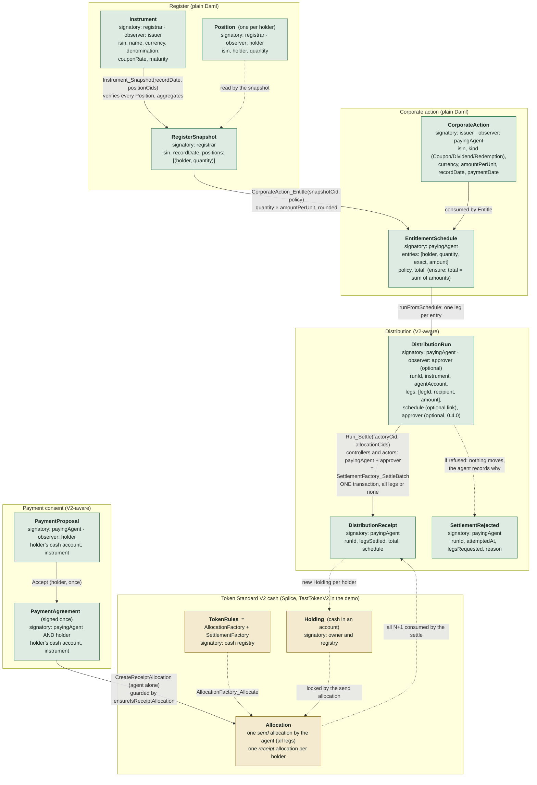
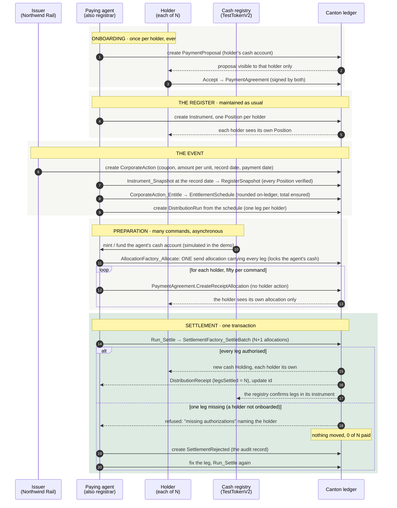

# Diagrams

Two drawings. The first is the model: every template, who signs it, who sees it, and how the contracts point at each other. The second is the workflow: what happens, in order, from a holder's onboarding to the one transaction that pays everyone. Both render on GitHub and in any Markdown viewer with Mermaid; for a slide, open this file on GitHub and screenshot.

Colour key: green is Indivisa's own Daml (`daml/indivisa`); amber is Token Standard V2, the cash, which Indivisa uses but does not own.

## 1. The templates and how they relate

Reading it: everything on the left half is ordinary Daml about the bond and the event; only the two boxes at the bottom right touch cash. The register is never copied into the cash layer: the schedule is derived on-ledger from a verified snapshot, the run carries only `(recipient, amount)` legs, and the settle consumes allocations, not positions.

Who sees what:

| Contract | Registrar / paying agent | Issuer | Holder | Cash registry |
|---|---|---|---|---|
| Instrument | yes | yes | no | no |
| Position | yes | no | **own only** | no |
| RegisterSnapshot | yes | via `Entitle` | no | no |
| CorporateAction | yes | yes | no | no |
| EntitlementSchedule | yes | via `Entitle` | no | no |
| PaymentAgreement | yes | no | own only | no |
| DistributionRun | yes | no | **no** | no |
| Allocation | all | no | **own only** | all (its instrument) |
| Holding (cash) | own | no | **own only** | all (its instrument) |
| DistributionReceipt / SettlementRejected | yes | no | no | no |

In the demo the paying agent is also the registrar.

## 2. The workflow, start to finish

Reading it: steps 1–3 happen once in a holder's life, and they are the holder providing their settlement instructions, which is the only thing a holder ever does. Steps 4–9 are the paying agent's ordinary work and produce no payment. Steps 10–13 are the only place cash is touched before the settle, and every one of them is a single-party command. Step 14 is the product: the one transaction. On LocalNet it commits in 1.6 s for 250 holders and 11.1 s for 1,000 (`benchmark.md`).

What the recording shows of this: the state after step 13 (the console: prepared, payments counted, and any holder's card opened showing zeros about everyone else), then step 14 both ways on **one** seat. The first coupon is refused because one holder has given the paying agent no settlement instructions, that holder provides them on their own page, the agent authorises and it settles. The second coupon on the same bond then settles under the approvers instead, which is step 14 as a governed execution.

Since 0.4.0 a run may name an **approver**, a decentralised party managed by BitSafe's Decentralization Manager. It joins the executors, so step 14 can only happen as a governed execution: the agent proposes, two of three members confirm, the engine executes. `decentralization.md` has that flow.
