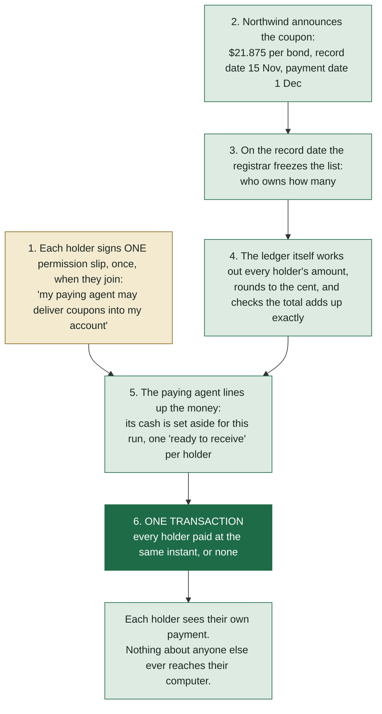
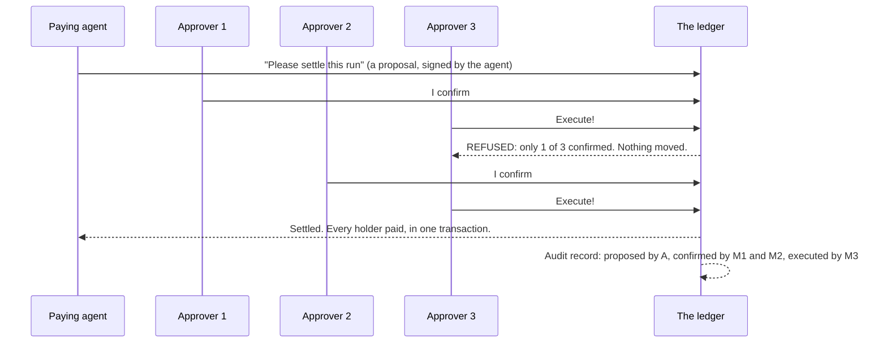

# Indivisa, explained from zero

This is the whole project, written for someone who has never heard of bonds, blockchains or smart contracts. Every word that sounds like jargon gets explained the first time it appears, and there is a glossary at the end. Read it in order; each part uses the one before it.

## Part 1. Lending money to a company

Imagine a company that builds railways. Call it Northwind Rail. It wants to build a new line, which costs a lot, and it does not have the money yet. So it borrows.

It could borrow from one bank. But a bank might not want to lend that much. So instead the company borrows a little from a lot of people, and it does that with a **bond**.

A bond is an IOU. Northwind prints, say, 50,000 IOUs, each one for $1,000. Anyone can buy one. If you buy one, you have lent Northwind $1,000, and in return Northwind promises you two things:

1. Every year, on a fixed date, it pays you a small thank-you for lending. With a 4% bond that is $40 a year for each $1,000. That yearly payment is called the **coupon** (a hundred years ago bonds were paper, and you literally cut a coupon off the sheet and took it to a bank to get paid; the name stuck).
2. On the end date, years later, it gives you your $1,000 back.

Some words for the people involved:

| Word | Who it is |
|---|---|
| **Issuer** | The borrower. Northwind Rail. It "issues" the bonds. |
| **Holder** | Anyone who owns a bond. You, a pension fund, a school's savings, a bank. In our story about 500 people and companies hold Northwind's bonds; some own one, some own hundreds. |
| **Register** | The list of who owns how many. It changes every day, because bonds get bought and sold. Whoever keeps that list is the **registrar**. |
| **Paying agent** | The company Northwind hires to actually pay the coupon. Northwind sends the paying agent one big sum; the paying agent splits it and pays every holder their share. |

Why does the register matter so much? Because it is **private**. How many bonds your neighbour owns, or a pension fund owns, is nobody else's business. In most countries it is against the law to publish it, and even where it is not, no company wants competitors to know its savings. Keep that in mind; it is the heart of the story.

## Part 2. Coupon day, the way it works now

Say the coupon date is 1 December. This is what has to happen:

1. A few weeks before, the registrar takes a snapshot of the register: who owns what on that day (the **record date**). If you buy a bond the day after, tough luck; the snapshot already happened.
2. Someone works out each holder's share: number of bonds × the coupon. Fractions of a cent appear (21.875 per bond, say), and every one has to be rounded, and all the rounded amounts still have to add up to exactly the total, or the books do not balance.
3. Northwind sends the total to the paying agent.
4. The paying agent sends every holder their amount. Five hundred payments. Hundreds of thousands of payments for a big bond.

Today this runs on spreadsheets, files sent between companies, and batches of bank transfers. Every hand-off is a chance to get something wrong: a stale list, a rounding mistake, a payment sent twice, a payment missed.

It sounds like a small back-office job. It is not. The industry's own numbers say that in one year American investors processed **3.7 million** of these events (coupons are one kind; dividends and other payouts are the same job), that mistakes cost each firm about **$3.4 million a year**, and that error rates of **3 to 10%** are considered normal here even though they would be a scandal anywhere else in finance. And roughly a tenth of what a broker spends in a year goes on fixing these mistakes.

So: an old, boring, expensive problem. Good. Those are the ones worth solving.

## Part 3. What a blockchain is, and why the usual kind cannot do this

A **ledger** is just a record of who has what and what moved. A bank keeps one for you. The trouble in Part 2 is that every company keeps its *own* ledger, and they all have to be reconciled with each other by hand.

A **blockchain** is one ledger that many computers share and agree on, so there is one truth instead of five copies. Money and other things can be represented on it as **tokens**: a token is an entry on that ledger saying "this belongs to that person", and moving it is a matter of everyone agreeing to change the entry. When you hear "settlement", it means exactly that: the moment ownership actually changes hands, for real, on the ledger.

On the famous blockchains (Bitcoin, Ethereum) *everyone can read everything*. That is a feature for them; for our problem it is fatal. The moment the paying agent pays 500 holders on a public blockchain, the whole register is published: every holder, every amount, for anyone to read. Illegal, and unacceptable. That is why no bank pays coupons on a public blockchain.

**Canton** is a blockchain built for exactly this objection. Each company runs its own computer, called a **participant** (or a **node**; same thing), and a participant only ever receives the records that concern its own people. If two holders are on different participants, neither computer ever *gets* the other's records. Not "gets them but hides them"; does not receive them at all. There is still one shared truth about what happened, but each computer holds only its own slice of it.

One more word: a **party**. On Canton, a party is a name with a secret key behind it, like an account that can sign for things. Every holder is a party; so is the paying agent; so is Northwind. A party lives on a participant, the way a mailbox lives in a building.

## Part 4. What a smart contract is

A **smart contract** is a rule written as a small program that the ledger itself enforces. Not a lawyer's contract; more like a vending machine: put in the right coins, press the button, and the machine does exactly what it was built to do, every time, and it will not give you the chocolate if a coin is missing.

On Canton, smart contracts are written in a language called **Daml**. A Daml contract says three things: what data it holds, who has agreed to it (its **signatories**), and what actions are allowed on it and by whom. The ledger refuses anything else. If a rule says "only the paying agent may press this", then nobody else can, no matter what software they use.

The word **transaction** matters too. A transaction is one change to the ledger, and it is **atomic**: either every part of it happens or none of it does. A transaction that moves money to 500 people either pays all 500 or pays nobody. There is no "it paid 380 and then crashed".

Hold on to those two ideas, private participants and atomic transactions, because Indivisa is nothing more than the two of them pointed at coupon day.

## Part 5. Indivisa

Indivisa is a small set of Daml smart contracts plus a screen, built by Chain-Experts for a competition called HackCanton. What it does, in one sentence:

> **The paying agent presses one button; one transaction pays every holder at the same instant, or nobody; and no holder can see anyone else's payment.**

Here is the whole flow. Read it top to bottom.

Some of the steps deserve a closer look.

**Step 1, the permission slip.** Canton's money rules (a standard called Token Standard V2, more below) say that money cannot be pushed into your account without your permission; both the sender and the receiver must have agreed. Five hundred holders clicking "accept" every coupon day would be hopeless. So each holder signs **one** standing agreement with the paying agent when they join, and never again. That is how the real world works too: you give your paying agent your account details once. The agreement is a smart contract signed by both, and it is carefully limited: the paying agent can use it to *deliver money to you*, and for nothing else. It cannot take money out.

**Step 4, the maths on the ledger.** The amounts are not worked out in a spreadsheet and typed in. A smart contract takes the frozen list and the announced rate and produces the schedule itself, on the ledger, with a rounding rule that guarantees the pennies add up to the announced total. Anyone who can see the schedule can check exactly which list and which rate it came from.

**Step 5, lining up the money.** Before the big moment, the paying agent sets its cash aside for this run (so it cannot spend it on something else in the meantime) and, using each holder's permission slip, creates one "ready to receive" note per holder. This part is many small steps and is *not* atomic; it can be done over an hour. Only step 6 is the one transaction.

**Step 6.** One press. The ledger checks that every leg has its money and its permission, and then moves all of it in one go. If a single holder's permission is missing, nothing moves for anyone, and the paying agent gets a message saying exactly which holder and why. Fix it, press again.

**The privacy part** is not something Indivisa built; it is how Canton delivers records. Each holder's computer receives its own payment and nothing else. In our demo you can look at a holder's screen and see the counts: other holders' positions: 0; other holders' payments: 0. Not hidden; never sent.

The paying agent, on the other hand, sees everything. It has to; that is its job. Indivisa does not pretend otherwise.

### What is real in the demo and what is pretend

Honesty is a rule of this project, so:

- **Real:** the ledger, the contracts, the one transaction, the refusal when a holder is not ready, every number on the screen.
- **Pretend:** the money. Nobody has put real dollars on Canton for this yet, so the demo uses the standard's own practice token (a "TestTokenV2"), which follows the same rules as real money would. The holders are made-up names with made-up amounts, and the demo says so on the screen.

## Part 6. We measured it, and we got it wrong once

A question nobody had answered in public: how many payments fit in one Canton transaction? A hundred? A thousand? If the answer had been "twenty", Indivisa would be a toy. So we built a test network of five computers on one machine and tried.

The answer: **a thousand payments in one transaction, in about eleven seconds.** Two hundred and fifty in under two seconds. The transaction with a thousand payments is 1.67 megabytes, and the network allows ten, so there was room for far more.

Then we went looking for the wall, because "there is room for more" is not a measurement. We kept adding payments until something refused. Thirteen thousand went through in about ten seconds. Fourteen thousand did not, and the thing that refused was not the payment itself. It was the *instruction* the paying agent sends beforehand, the one that says "here is my money for all these payments": that message is about 756 bytes per payment, and the network refuses any single message over ten megabytes. Thirteen thousand eight hundred and sixty-nine payments is where that message runs out of room. If anyone ever needs more, the fix is already allowed by the rules: send two such instructions instead of one.

So the honest summary is two numbers, not one. **Thirteen thousand payments in one transaction**, which is what we measured. And for a real coupon run, where every holder needs their own slip of paperwork alongside the payment, about **six thousand four hundred holders** before the transaction reaches the ten-megabyte limit. The second number is a calculation, not a measurement, and we say so; the arithmetic it is based on predicts the thousand-holder run we did measure to within one part in a hundred and fifty.

And here is the part worth remembering. The first time we measured, we got **333 seconds** for a thousand, and wrote a whole story about a "latency wall". It was wrong. We had put the stopwatch in the wrong place: inside the test tool, which spent five minutes reading its own results after the ledger had long finished. Only when we read the network's own log did we see the ledger was done in eight seconds. Lesson for life, not just for software: measure the thing itself, not the thing next to it, and when the number surprises you, look for where the time actually went.

## Part 7. The second challenge: nobody should hold the big button alone

Look at step 6 again. One person, the paying agent, presses one button, and $1.2 million moves. What if that person is careless? Or dishonest? Or their password is stolen? Real payment departments never allow this. They use the **four-eyes rule**: two people must approve anything big. Indivisa, as described so far, had no four-eyes rule at all.

A company called BitSafe makes open-source tools for Canton and set a side challenge at the hackathon: use our tools to put shared control into your project. Their tool is called the **Decentralization Manager** (DecMan for short), and the idea behind it is a **decentralised party**.

Remember that a party is a name with a secret key. A decentralised party is a name whose key is *split between several computers run by several organisations*, with a rule like "two of the three must agree". No single one of them can act as that party alone. It is a committee with a shared signature.

What we did with it: a coupon run can now name an **approver**, and the approver is a decentralised party. The money rules on Canton say a settlement needs the authority of everyone named as an executor, so once the approver is named, the paying agent's own button is refused by the ledger. The only way to settle is a vote:

Three things to notice:

1. The paying agent can still *see* everything and still does all the preparation. It just cannot pull the trigger alone.
2. The rule "two of three" lives in a smart contract on the ledger, not in BitSafe's software and not in ours. Even someone who controls the software cannot execute with one approval.
3. Every step leaves a record: who proposed, who confirmed, who executed. That record is what an auditor would ask for.

We built two small things for this: a "proposal" contract that says "settle this run" and can be voted on with BitSafe's tool, and a more general version that works for any batch payment on Canton, which we are offering back to BitSafe for anyone to use. And we added exactly one line to Indivisa's run: the optional approver. Nothing else in the payment changed.

One honest note we put in big letters: in our test, the three "approvers" were three computers on one desk, run by one person. That proves the mechanism works; it does not prove three independent companies would use it. For the real version on Canton's test network, BitSafe themselves will run the second computer, so that a settlement genuinely needs a company that is not us to say yes.

## Part 8. Why this matters

Nothing in Indivisa is a new invention. Canton existed; the money rules existed (they were approved in June 2026); the paying agent's job has existed for a century. What we did was notice that a new tool, made for one purpose (trading between banks), quietly made a very old, very expensive problem solvable, and then build the smallest thing that proves it, measure it, and say plainly what is real and what is not.

That is most of what engineering is.

## Glossary

| Term | Plain meaning |
|---|---|
| Bond | An IOU sold to many people at once. You lend, you get a yearly coupon, you get your money back at the end. |
| Coupon | The yearly interest payment on a bond. |
| Issuer | The borrower who created the bond. |
| Holder | Someone who owns a bond. |
| Register | The private list of who holds how many bonds. |
| Registrar | Whoever keeps the register. |
| Record date | The day the register is frozen to decide who gets paid. |
| Payment date | The day the money moves. |
| Paying agent | The company that pays the coupon out to all the holders on the issuer's behalf. |
| Settlement | The moment ownership of money or anything else actually changes hands. |
| Ledger | A record of who has what and what moved. |
| Blockchain | A ledger shared by many computers that all agree on it. |
| Token | An entry on a ledger that represents something you own, such as money. |
| Canton | A blockchain where each company's computer receives only the records that concern it. |
| Participant / node | One company's computer on Canton. |
| Party | A name with a secret key behind it; the thing that owns and signs on Canton. |
| Smart contract | A rule written as a program that the ledger enforces, like a vending machine. |
| Daml | The language Canton's smart contracts are written in. |
| Signatory | A party that has agreed to a contract; nothing about it can change without them. |
| Transaction | One change to the ledger. All of it happens or none of it. |
| Atomic | "All or nothing", said of a transaction. |
| Token Standard V2 | Canton's shared rulebook for how money tokens move, approved June 2026. Indivisa's money follows it. |
| Allocation | A "set aside" or "ready to receive" note made before a settlement, one per side of each payment. |
| Four-eyes rule | Two people must approve before something important happens. |
| Decentralised party | A party whose key is split across several organisations' computers, with a rule like "two of three must agree". |
| Decentralization Manager (DecMan) | BitSafe's open-source tool for running a decentralised party and voting on its actions. |
| Approver | In Indivisa, the decentralised party a run can name; once named, the paying agent cannot settle without its vote. |
| Audit trail | The record of who did what and when, kept on the ledger. |
| HackCanton | The competition Indivisa was built for, run by the Canton community. |

## If you want to go further

- The short version for grown-ups, one page: `docs/explainer.html`.
- The numbers, with how they were measured: `docs/benchmark.md`.
- The shared-control part in full: `docs/decentralization.md`.
- The code itself starts in `daml/indivisa/Indivisa/Model/`. `Distribution.daml`
  is the one with the button.
